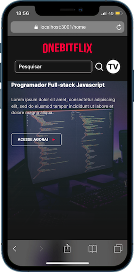
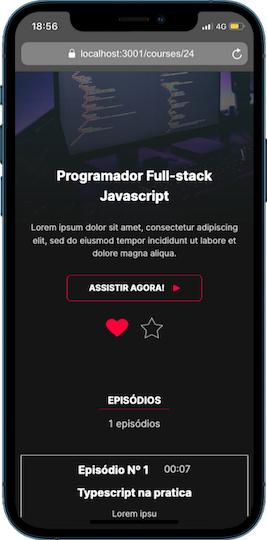

# Frontend OnebitFlix

Esse é o Frontend para o projeto final do curso FullStack da Onebitecode. O projeto é uma especie de EAD de cursos com um design baseado na Netflix. [Clique aqui](https://github.com/thiagovt-dev/OnebitFlix_backend) e acesse o repositorio do backend do projeto


## Algumas Stacks utilizada

* Next.js 14
* React
* Typescript
* Reactstrap
* scss
* Framer motion
* Splide.js
## Documentação

Originalmente, o projeto foi elaborado utilizando a versão 12 do NEXTjs. Como o intuito era testar novas habilidades, resolvi utilizar a versão mais atual do NEXT que é a 14. [Confira aqui a documentação](https://nextjs.org/docs).

A maior diferença da versão 12 para as versões posteriores, além de usar agora App router em vez do Pages Router é o fato da renderização do lado do cliente e do lado do servidor. Essa nova atualização permite separar o que vai ser renderizado do lado do cliente utilizando o "use client" e o que vai ser renderizado somente do lado do servidor, possibilitando uma aplicação mais rápido e menos JS no lado do cliente.


## Rodando localmente

Clone o projeto

```bash
  gh repo clone thiagovt-dev/onebitflix_frontend
```

Entre no diretório do projeto

```bash
  cd OnebitFlix_frontend
```

Instale as dependências

```bash
  npm install
```

Certifique-se que as dependencias globais e de desenvolvimento foram instaladas conferindo o package.json


Inicie o projeto localmente usando


```bash
    npm run dev
```

**Obs.:** Se for executar localmente junto com a api do backend, inicie primeiro a api e depois o frontend.


## Conclusão

Por fim, o projeto foi excelente para por em prática os estudos e o desenvolvimento frontend. Como o projeto se trata de fins puramente acadêmicos, ainda não foi realizado o deploy, mas ele pode ser facilmente realizado posteriormente.
No final, percebi que poderia ter utilizado mais dos recursos do proprio NEXTjs, mas irei aplicar nos proximos projetos
## Screenshots
Veja alguns screenshots do projeto final






